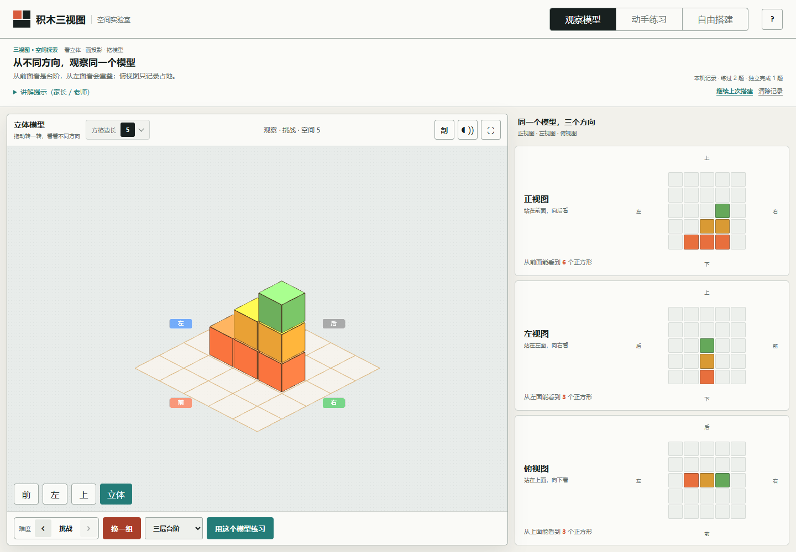

# 积木三视图实验室 · Sanview

一个**通用的三视图与空间探索工作台**。自由选择观察、练习或搭建，用积木验证立体模型与正视图、左视图、俯视图之间的关系。适合教师演示、学生独立练习、家长陪学，也适合任何人探索遮挡、投影和剖切。

[在线体验](https://863401402.github.io/sanview/) · [GitHub 仓库](https://github.com/863401402/sanview) · [产品定位与学习路线](docs/PRODUCT.md)

无需账号、身份选择或固定课程。讲解提示可以辅助共同讨论；练习记录用于回顾近期操作，不作考试评分或能力诊断。积木模型适合空间关系验证，不承担专业 CAD 的工程尺寸制图。



## 三大模式，按需使用

| 模式 | 可以做什么 | 适用目的 |
| --- | --- | --- |
| 观察 | 打开固定范例或随机结构，切换视角、比较投影、剖切内部 | 讲解示范、辨认方向、理解遮挡 |
| 练习 | 看模型画三视图，或按目标三视图还原积木 | 独立练习、共同讨论和自我检查 |
| 搭建 | 自由增减积木，改变空间尺寸，保存和交换作品 | 创作模型、验证空间假设 |

三种模式平级，可直接进入任意一种。想循序学习时，可参考“观察范例 → 画三视图 → 按三视图还原 → 自由搭建”的顺序，但无需逐关完成。观察模式中的“用这个模型练习”会保留当前模型并进入绘图，便于围绕同一个结构继续验证。

默认空间为 `4 × 4 × 4`，从简单难度和“三层台阶”示范开始。空间边长可选 3–8，随机题有四档难度。家长陪约 6–12 岁孩子学习是常见场景之一，年龄和使用身份不限制工具用途。

## 主要能力

- “三层台阶”“转角积木”“两座小塔”三个固定范例与随机结构；可选的“讲解提示（家长/老师）”帮助提问、解释和共同验证。
- 前、左、上及立体视角；点击 `?` 按需打开对应教程。手机可逐幅选择正视图、左视图、俯视图，随时回看模型，切换时保留图纸状态。
- 画图检查标出漏填与多填；还原任务只比较三幅投影，符合投影的不同结构都可通过。
- 3D 场景与俯视搭建盘支持增减积木；非底层必须有正下方支撑，拆除须从该列顶部开始。
- 搭建支持最近 80 步撤销、重做；缩小空间和导入作品也可以撤销。历史只保留在当前页面会话内。
- 自由搭建自动保存最近一件作品，可恢复继续搭建，也可导出、导入 JSON 文件在设备间转移。
- 供自己或陪学者回顾的练习记录保留最近 200 道题；同一题反复检查不重复累计，查看参考答案后不计独立完成。
- 剖切平面可移动、旋转和反向保留，并显示封闭截面；剖切不改变原模型或判题结果。
- 预生成教学语音、浏览器朗读回退，以及鼠标、触摸和键盘操作。

作品、练习记录和教程状态保存在当前浏览器。不同站点或浏览器之间不会自动同步；浏览器拒绝存储时，本页仍可练习，作品应及时导出。清除练习记录不会删除保存的作品。详见 [隐私说明](PRIVACY.md)。

<details>
<summary>查看移动端界面</summary>


</details>

## 本地运行

需要 Node.js 20 或更高版本：

```bash
npm start
```

打开 [本地应用](http://127.0.0.1:4173/)。启动脚本使用 Node.js 自带模块，仅监听 `127.0.0.1:4173`。应用是静态 HTML、CSS 和 JavaScript，无运行时包依赖，启动不需要先安装开发依赖。Three.js 与 OrbitControls 随仓库提供。

## 开发、测试与构建

```bash
npm ci
npx playwright install chromium
npm run check
npm test
npm run build
```

`npm run check` 执行语法检查和单元测试；`npm test` 包含单元测试与真实浏览器端到端测试。Playwright 仅为开发依赖，浏览器测试会自行启动并关闭临时本地服务器。GitHub Actions 使用 Node.js 22，项目要求最低 Node.js 20。

如果电脑已有 Chrome，可把 `SANVIEW_BROWSER` 设置为其可执行文件的绝对路径，跳过 Chromium 下载。例如 PowerShell：

```powershell
$env:SANVIEW_BROWSER = 'C:\Program Files\Google\Chrome\Application\chrome.exe'
npm test
```

请使用本机实际存在的路径。默认自动化浏览器覆盖为 Chromium；Safari 和微信内置浏览器应按 [发布清单](docs/RELEASE_CHECKLIST.md) 实机验证，不能从 Chromium 测试通过推定其兼容性。

`npm run build` 将静态发布文件整理到 `_site/`，用于 GitHub Pages 或其他静态托管。它不需要打包框架或在线 CDN。`.github/workflows/ci.yml` 在同一工作流中先测试、再构建，`main` 的检查成功后才部署 Pages；实际部署状态以仓库 Actions 结果为准。

## 项目结构

```text
assets/audio/          预生成的教学语音
assets/screenshots/    实际界面截图
css/style.css          布局、交互与可访问性样式
js/app.js              DOM、Three.js 场景与各模块的交互协调
js/coordinates.js      坐标约定、投影与随机结构算法
js/model-library.js    固定教学范例
js/learning-state.js   练习统计、作品校验与安全本地存储
js/section-geometry.js 剖切平面与立方体求交算法
js/voice-library.js    语音文本与静态资源清单
scripts/serve.js       本地静态服务
scripts/build-site.js  整理静态发布产物
tests/                 单元测试与浏览器端到端测试
docs/                  产品、架构与发布说明
index.html             应用入口
```

模块约定与数据格式见 [架构说明](docs/ARCHITECTURE.md)。

## 维护教学语音

仓库已包含 MP3，正常使用不需要语音服务账号或 API Key。重新生成语音时需要维护者配置 `MIMO_API_KEY` 环境变量和 `ffmpeg`，再运行 `npm run voice:generate`。生成脚本请求 MiMo 返回 WAV，转为压缩 MP3 后清理临时 WAV；`MIMO_TTS_BITRATE` 可调整码率，`--force` 可覆盖已有音频。

不要把密钥写入源码、前端配置或提交记录。公开分发生成音频前，应核对 [第三方软件声明](THIRD_PARTY_NOTICES.md) 中的适用条款。

## 贡献与许可

欢迎围绕空间探索、独立练习和教学演示中的实际问题提交改进。请先阅读 [贡献指南](CONTRIBUTING.md)、[社区行为准则](CODE_OF_CONDUCT.md) 和 [发布清单](docs/RELEASE_CHECKLIST.md)。安全问题请按 [安全政策](SECURITY.md) 私密报告。

当前文档对应 **1.1.0（2026-10-02）**，变化见 [更新日志](CHANGELOG.md)。软件代码采用 [MIT License](LICENSE)；分发时须保留 [第三方声明](THIRD_PARTY_NOTICES.md) 和 [Three.js / OrbitControls 许可](third_party_licenses/threejs.txt)。
