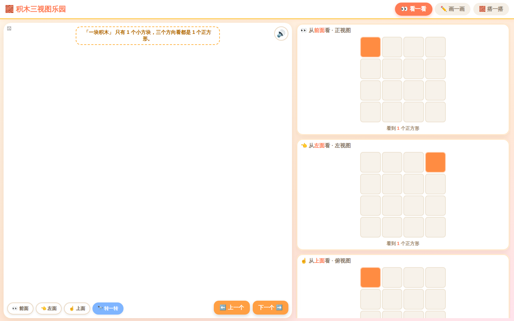

# 积木三视图实验室

一个面向幼儿园和小学阶段的三视图互动学习工具。学生可以观察积木模型、绘制正视图、左视图和俯视图，也可以根据投影还原结构或自由搭建。



## 主要功能

- **观察**：按空间大小与四档难度随机生成可支撑的积木结构，从前、左、上和立体方向观察；
- **画视图**：观察立体结构，在网格中完成三幅投影并逐项检查；
- **还原积木**：根据目标三视图反向搭建，按三幅投影一致判定，不限制唯一结构；
- **自由搭建**：使用 3 至 8 的立方空间、3D 场景和俯视搭建盘自由创作；
- **任意剖切**：移动或旋转切平面，查看带封闭切口的内部结构，并可反向选择保留侧；
- **分模块教程**：四个任务各有独立的新手引导，首次进入自动出现，也可随时从帮助按钮重开；
- **儿童语音**：预生成教学旁白与多版本反馈，静态加载失败时回退到浏览器中文朗读；
- **多端交互**：支持鼠标左右键、触摸、键盘操作和响应式布局。

默认空间为 `4 x 4 x 4`，最大为 `8 x 8 x 8`。这个范围兼顾了低龄学习者的可读性、移动端操作密度和 3D 场景性能。

## 快速开始

项目没有构建步骤，是纯静态 HTML、CSS 和 JavaScript：

```bash
python3 -m http.server 4173
```

浏览器访问 `http://127.0.0.1:4173`。也可以部署到 GitHub Pages、静态对象存储或任意 Web 服务器。

## 开发与测试

需要 Node.js 20 或更高版本。

```bash
npm ci
npm run check
```

`npm run check` 只执行语法检查和单元测试，不会启动浏览器。端到端测试需要另行安装 Chromium：

```bash
npx playwright install chromium
npm run test:e2e
```

完整检查可运行 `npm test`。端到端测试会自行启动临时本地服务器，结束时关闭浏览器和服务器。

## 生成语音

仓库已包含运行所需的压缩 MP3，无需在浏览器中调用语音服务。重新生成需要 `ffmpeg`，API Key 只从本地环境变量读取：

```bash
MIMO_API_KEY=your_key npm run voice:generate
```

生成脚本请求 MiMo 返回 WAV，再转为 24 kHz、单声道、64 kbps MP3 并删除临时 WAV。可用 `MIMO_TTS_BITRATE` 调整码率，用 `--force` 覆盖已有文件。提交生成资产前请核对 [第三方软件声明](THIRD_PARTY_NOTICES.md) 中的分发注意事项。

## 项目结构

```text
assets/audio/          预生成的教学语音
css/style.css          页面布局与视觉样式
js/app.js              3D 场景、模式状态与交互
js/coordinates.js      坐标约定、投影与随机结构算法
js/section-geometry.js 剖切平面与立方体求交算法
js/voice-library.js    语音文本与静态资源清单
scripts/               维护脚本
tests/                 单元测试与浏览器端到端测试
index.html             应用入口
```

坐标方向和投影数组顺序集中定义在 `js/coordinates.js`。修改观察方向、投影或随机结构算法时，请同时补充该模块的单元测试。

## 参与贡献

欢迎提交可复现的问题和有明确教学场景的改进建议。开始前请阅读 [贡献指南](CONTRIBUTING.md)、[架构说明](docs/ARCHITECTURE.md) 和 [社区行为准则](CODE_OF_CONDUCT.md)。维护者首次公开仓库前可按 [发布清单](docs/RELEASE_CHECKLIST.md) 完成 GitHub 侧配置。

安全问题请按 [安全政策](SECURITY.md) 私密报告。项目不上传学习数据，具体边界见 [隐私说明](PRIVACY.md)。第三方代码与生成资产信息见 [第三方软件声明](THIRD_PARTY_NOTICES.md)。

## License

软件代码根据 [MIT License](LICENSE) 发布。第三方代码和生成资产还应遵守各自适用的条款。
